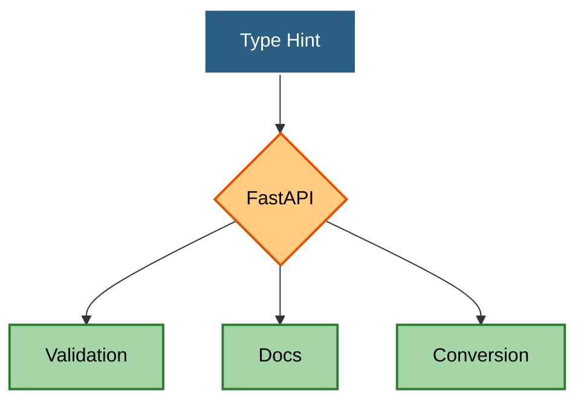
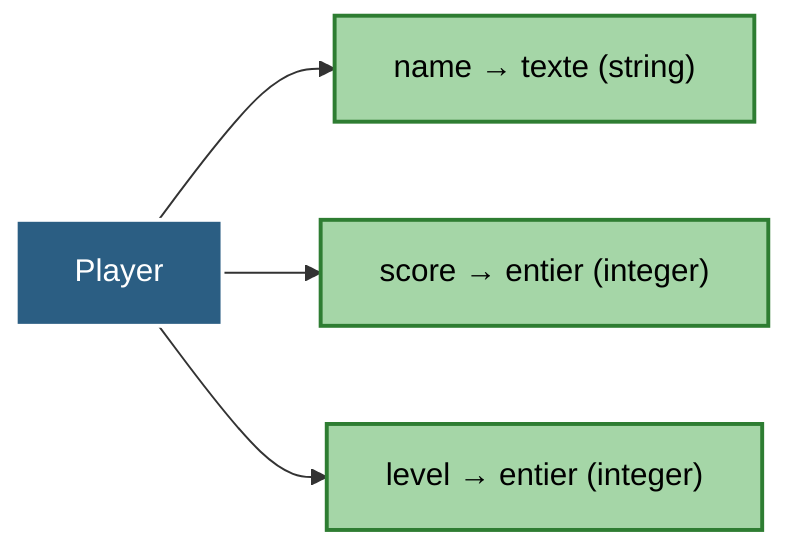
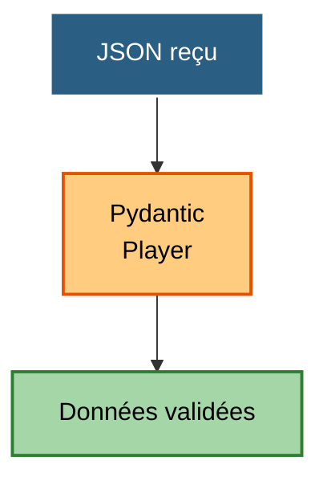
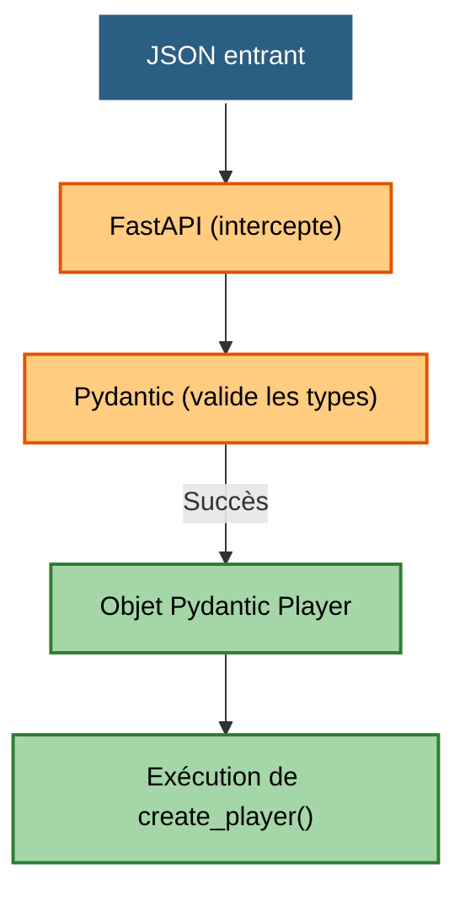
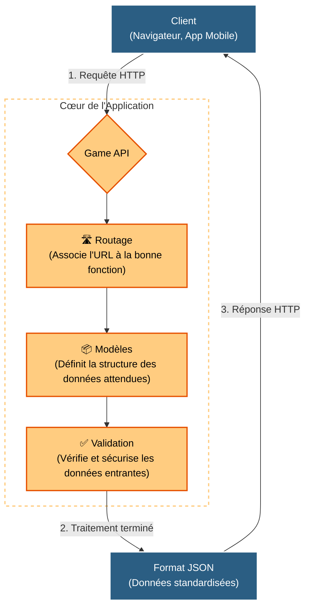

# Fondamentaux des API avec Python

## FastAPI · Pydantic

---

# Objectifs

À la fin de cette séance, vous serez capables de :

* comprendre ce qu'est une API ;
* expliquer le fonctionnement d'une communication client / serveur ;
* comprendre les principes fondamentaux d'une API REST ;
* utiliser les principales méthodes HTTP ;
* créer une API REST avec **FastAPI** ;
* définir des routes et leurs paramètres ;
* recevoir et retourner des données JSON ;
* créer des modèles avec **Pydantic** ;
* valider automatiquement les données reçues ;
* définir le contrat de réponse d'une API ;
* comprendre le rôle d'**OpenAPI** ;
* utiliser **Swagger UI** pour tester une API ;
* comprendre comment FastAPI génère automatiquement sa documentation.

---

# 16. Les annotations de type des variables (Type Hints)

Actuellement, notre `player_id` est interprété comme du texte. Nous voulons que ce soit un nombre entier.

Nous pouvons l'indiquer à FastAPI en écrivant :

```python
@app.get("/players/{player_id}")
def get_player(player_id: int):
    # Pour tester, on renvoie juste l'ID converti
    return {
        "id": player_id
    }
```

Maintenant, la requête :

```text
GET /players/42
```

est valide.

Mais si on essaie :

```text
GET /players/hello
```

FastAPI renvoie automatiquement une erreur détaillée expliquant que "hello" n'est pas un entier valide.

FastAPI connaît le type attendu grâce au **Type Hint** :

```python
player_id: int
```

---

# 17. Les Type Hints deviennent un outil de validation

C'est une caractéristique fondamentale de FastAPI.

Dans Python classique, écrire :

```python
player_id: int
```

est une simple annotation (une indication pour le développeur).

FastAPI, en revanche, utilise activement cette information pour :

* **analyser la requête** ;
* **convertir les données** (transformer le texte de l'URL en entier Python) ;
* **valider les données** (rejeter la requête si ce n'est pas un nombre) ;
* **générer la documentation automatiquement**.



---

# 18. Faire évoluer nos données

Jusqu'à présent, nous utilisions un dictionnaire avec du texte en guise de clé (`"42"`).

Maintenant que nous savons gérer de vrais entiers, rapprochons-nous d'une vraie base de données en utilisant une liste Python contenant nos joueurs.

Remplaçons notre ancien dictionnaire `PLAYERS` par cette liste `players` :

```python
players = [
    {
        "id": 1,
        "name": "Alice",
        "score": 1200,
        "level": 12,
    },
    {
        "id": 2,
        "name": "Bob",
        "score": 950,
        "level": 9,
    },
    {
        "id": 42,
        "name": "Zelda",
        "score": 3000,
        "level": 99,
    }
]

```

Notre route globale reste très simple :

```python
@app.get("/players")
def get_players():
    return players
```

---

# 19. Récupérer un joueur dans la liste

Nous pouvons maintenant utiliser notre `player_id: int` pour chercher le bon joueur en parcourant notre liste.

La comparaison fonctionnera parfaitement car FastAPI a converti le paramètre de l'URL en entier, et les "id" de notre liste sont aussi des entiers !

```python
@app.get("/players/{player_id}")
def get_player(player_id: int):
    for player in players:
        if player["id"] == player_id:
            return player

    # Si la boucle se termine sans rien trouver :
    return {"error": "Player not found"}
```

Nous pouvons maintenant appeler :

```text
GET /players/1
```

ou :

```text
GET /players/42
```

Si nous demandons le joueur `99`, l'API renverra gentiment :
`{"error": "Player not found"}`


---

# 20. Un problème apparaît...

Notre API doit également permettre de **créer** un joueur.

Nous voulons recevoir les informations du nouveau joueur de la part du client (le navigateur ou l'application). Notez que nous ne demandons pas l'`id` : c'est le rôle du serveur de le générer !

Voici le JSON que nous attendons :

```json
{
    "name": "Charlie",
    "score": 1000,
    "level": 1
}

```

Mais comment indiquer à FastAPI :

* quels champs sont obligatoires ?
* quels sont leurs types ?
* quelles valeurs sont acceptées ?
* à quoi doit ressembler le JSON ?

C'est ici que **Pydantic** intervient.

---

# 21. Pydantic

Pydantic est une bibliothèque intégrée à FastAPI qui permet de définir des modèles de données en Python.

Nous créons une classe :

```python
from pydantic import BaseModel


class Player(BaseModel):
    name: str
    score: int
    level: int

```

Nous venons de définir le modèle (la forme attendue) d'un joueur entrant.

---

# 22. Le modèle comme contrat

Notre modèle dicte des règles strictes :



On peut donc considérer `Player` comme un **contrat de données**. Si le client ne respecte pas le contrat, la requête sera rejetée avant même de toucher notre code.



---

# 23. Utiliser un modèle dans une route

Nous pouvons maintenant utiliser ce contrat dans une nouvelle route `POST` (utilisée pour créer des données) et ajouter ce joueur à notre liste de la section 18 :

```python
@app.post("/players")
def create_player(player: Player):
    # 1. On transforme l'objet validé par Pydantic en dictionnaire
    new_player = player.model_dump()
    
    # 2. On génère un nouvel ID (par exemple, la taille de la liste + 1)
    new_player["id"] = len(players) + 1
    
    # 3. On l'ajoute à notre fausse base de données
    players.append(new_player)
    
    return new_player

```

Le Type Hint `player: Player` indique à FastAPI :

> Le corps de la requête doit respecter le modèle `Player`.

---

# 24. Tester avec JSON

Si une requête `POST` contient le bon format :

```json
{
    "name": "Charlie",
    "score": 1000,
    "level": 1
}
```

Tester en ligne de commande (cURL)
Il faut préciser que c'est une requête `POST`, indiquer que l'on envoie du JSON via le *Header*, et inclure les données :

```bash
curl -X POST http://127.0.0.1:8000/players \
     -H "Content-Type: application/json" \
     -d '{"name": "Charlie", "score": 1000, "level": 1}'

```

Vérification:
```bash
curl -X GET http://127.0.0.1:8000/players
```

Voici ce que fait FastAPI en coulisses :

1. Il reçoit le texte JSON.
2. Il demande à Pydantic de vérifier les types.
3. Il construit un objet Python `Player`.
4. Il l'injecte dans notre fonction `create_player()`.



---

# 25. Et si les données sont incorrectes ?

Essayons d'envoyer une erreur classique (le score est du texte au lieu d'un nombre) :

```json
{
    "name": "Charlie",
    "score": "mille",
    "level": 1
}
```

Le champ `score` doit être un entier.

FastAPI détecte automatiquement le problème et renvoie une erreur `422 Unprocessable Entity` au client, avec un message expliquant précisément que `score` n'est pas un entier valide.

```bash
curl -X POST http://127.0.0.1:8000/players \
     -H "Content-Type: application/json" \
     -d '{"name": "Charlie_error", "score": "mille", "level": 1}'

```

Nous n'avons **pas** eu besoin d'écrire du code de vérification comme :

```python
if not isinstance(score, int):
    return "Erreur..."

```

La validation nous protège par défaut.

---

# 26. Ajouter des contraintes

Les types (texte, entier) ne sont pas toujours suffisants.

Par exemple :

* Le nom doit faire au moins 3 caractères.
* Le score ne peut pas être négatif.
* Le niveau commence au minimum à 1.

Nous pouvons utiliser `Field` de Pydantic pour ajouter ces règles métier :

```python
from pydantic import BaseModel, Field


class Player(BaseModel):
    name: str = Field(min_length=3)
    score: int = Field(ge=0) # ge = Greater than or Equal (>=)
    level: int = Field(ge=1)

```

---

# 27. Pourquoi est-ce si puissant ?

Nous avons défini nos règles complexes **à un seul endroit**, de manière très lisible.

```python
class Player(BaseModel):
    name: str = Field(min_length=3)
    score: int = Field(ge=0)
    level: int = Field(ge=1)

```

FastAPI et Pydantic utilisent ensemble ce modèle pour :

* **Protéger l'API** (Rejeter les requêtes frauduleuses ou mal formatées).
* **Convertir les données** (JSON vers Python).
* **Générer le schéma OpenAPI** (qui décrit les règles exactes).
* **Mettre à jour la documentation automatique**, où les utilisateurs verront instantanément que le score doit être `>= 0`.


# 28. Une API REST complète

Nous avons créé les routes pour lire (GET) et ajouter (POST) des joueurs. Pour être complète, notre API doit aussi permettre de modifier et de supprimer des données.

Voici à quoi ressemble l'architecture standard d'une API REST (aussi appelée modèle CRUD : Create, Read, Update, Delete) :

```text
GET    /players             (Lire tous les joueurs)
GET    /players/{player_id} (Lire un joueur précis)
POST   /players             (Créer un nouveau joueur)
PUT    /players/{player_id} (Mettre à jour un joueur existant)
DELETE /players/{player_id} (Supprimer un joueur)

```

Nous avons maintenant rassemblé les briques fondamentales d'une application web moderne :



---

# 29. Le contrat d'une API

Une API n'est utile que si les autres (un navigateur, une application mobile, un autre serveur) peuvent l'utiliser. Elle doit répondre clairement à la question :

> « Comment dois-je communiquer avec le serveur ? »

Par exemple, pour faire un `POST /players`, le client doit absolument savoir :

* que la route existe ;
* qu'elle utilise bien la méthode `POST` ;
* quels champs envoyer dans le JSON ;
* quels sont leurs types (`str`, `int`) et leurs contraintes (`>= 0`) ;
* quels champs sont obligatoires ou optionnels ;
* à quoi ressemblera la réponse en cas de succès ;
* quelles erreurs peuvent être retournées (comme l'erreur 422).

L'ensemble de ces règles strictes constitue le **contrat de l'API**.

> **La magie de FastAPI :** Historiquement, les développeurs devaient rédiger ce contrat manuellement (souvent dans de longs fichiers texte ou Word qui n'étaient jamais à jour). Grâce à vos Type Hints et à vos modèles Pydantic, FastAPI écrit ce contrat automatiquement (via le standard OpenAPI) et le rend interactif sur la page `[http://127.0.0.1:8000/docs](http://127.0.0.1:8000/docs)` !

---
