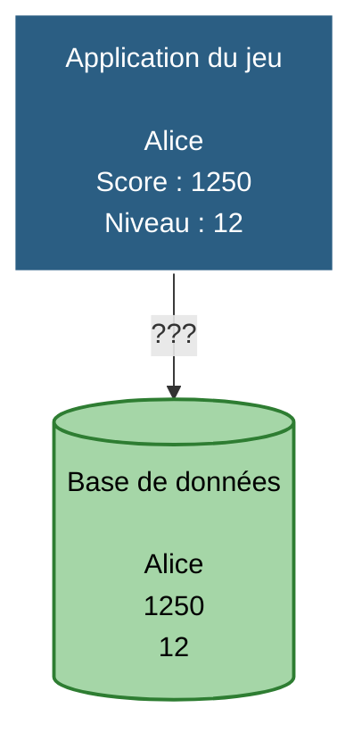
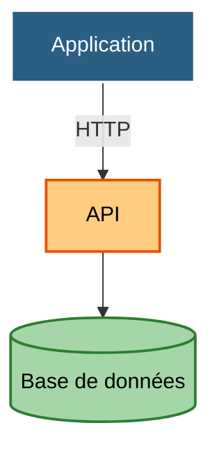
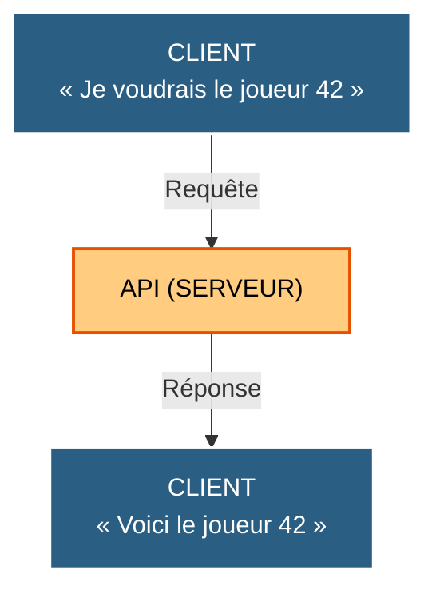

# Fondamentaux des API avec Python

## FastAPI · Pydantic · REST · OpenAPI · Swagger UI

---

# Objectifs

À la fin de cette séance, vous serez capables de :

* comprendre ce qu'est une API ;
* expliquer le fonctionnement d'une communication client / serveur ;
* comprendre les principes fondamentaux d'une API REST ;
* utiliser les principales méthodes HTTP ;
* créer une API REST avec **FastAPI** ;
* définir des routes et leurs paramètres ;
* recevoir et retourner des données JSON ;
* créer des modèles avec **Pydantic** ;
* valider automatiquement les données reçues ;
* définir le contrat de réponse d'une API ;
* comprendre le rôle d'**OpenAPI** ;
* utiliser **Swagger UI** pour tester une API ;
* comprendre comment FastAPI génère automatiquement sa documentation.

---

# 1. Pourquoi avons-nous besoin d'APIs ?

Imaginez une application de jeu vidéo.

L'application affiche :

* le nom du joueur ;
* son score ;
* son niveau ;
* son classement.

Mais où sont stockées ces informations ?



L'application pourrait-elle accéder directement à la base de données ?

**Oui, techniquement.**

Mais ce serait rarement une bonne architecture.

On préfère intercaler une couche permettant de contrôler les échanges :



Cette couche est une **API**.

---

# 2. Qu'est-ce qu'une API ?

API signifie :

> **Application Programming Interface**

Une API est une **interface permettant à un programme d'interagir avec un autre programme ou service**.

L'API définit notamment :

* comment demander une information ;
* quelles informations envoyer ;
* comment les données sont structurées ;
* quelles réponses sont possibles ;
* quelles erreurs peuvent être retournées.

---

## Une API comme contrat

On peut voir une API comme un contrat entre deux applications.




Le client n'a pas besoin de connaître :

* le langage utilisé par le serveur ;
* la base de données ;
* l'architecture interne ;
* le code du serveur.

Il doit simplement connaître **le contrat de l'API**.

---

# 3. Exemple : utiliser une API existante

Python peut communiquer avec une API grâce à HTTP.

Par exemple :

```python
import requests

response = requests.get(
    "https://api.github.com/users/python"
)

print(response.status_code)
print(response.json())
```

La fonction `requests.get()` envoie une requête HTTP.

Le serveur retourne une réponse.

```text
Python
  │
  │ GET /users/python
  ▼
GitHub API
  │
  │ JSON
  ▼
Python
```

---

## Que contient une réponse HTTP ?

Une réponse possède notamment :

* un **code de statut** ;
* des **en-têtes** ;
* un **contenu**.

Exemple :

```text
HTTP/1.1 200 OK

Content-Type: application/json

{
    "login": "python",
    "id": 1525981
}
```

---

# 4. Les codes HTTP

Quelques codes sont particulièrement importants.

|  Code | Signification                    |
| ----: | -------------------------------- |
| `200` | La requête a réussi              |
| `201` | Une ressource a été créée        |
| `204` | Succès, sans contenu à retourner |
| `400` | Requête incorrecte               |
| `401` | Authentification nécessaire      |
| `403` | Accès interdit                   |
| `404` | Ressource inexistante            |
| `422` | Données reçues invalides         |
| `500` | Erreur interne du serveur        |

Une API ne doit donc pas seulement retourner des données.

Elle doit également indiquer **ce qui s'est passé**.

---

# 5. Le format JSON

Les APIs REST utilisent très souvent le format **JSON**.

JSON permet de représenter des données structurées.

```json
{
    "id": 42,
    "name": "Alice",
    "score": 1250
}
```

Un objet JSON peut contenir :

* des chaînes de caractères ;
* des nombres ;
* des booléens ;
* des tableaux ;
* d'autres objets.

Par exemple :

```json
{
    "id": 42,
    "name": "Alice",
    "score": 1250,
    "weapons": [
        "sword",
        "bow"
    ],
    "active": true
}
```

---

# 6. API REST

REST signifie :

> **Representational State Transfer**

REST est un ensemble de principes permettant notamment d'organiser une API autour de **ressources**.

Dans notre jeu, les ressources pourraient être :

```text
players
games
weapons
scores
```

On peut alors imaginer :

```text
GET    /players
GET    /players/42

POST   /players

PUT    /players/42

DELETE /players/42
```

---

# 7. Les méthodes HTTP

Les quatre méthodes principales que nous utiliserons sont :

| Méthode  | Action    |
| -------- | --------- |
| `GET`    | Lire      |
| `POST`   | Créer     |
| `PUT`    | Modifier  |
| `DELETE` | Supprimer |

On peut les rapprocher des opérations CRUD :

| HTTP   | CRUD   |
| ------ | ------ |
| GET    | Read   |
| POST   | Create |
| PUT    | Update |
| DELETE | Delete |

---

# 8. Notre fil rouge : Game API

Nous allons construire progressivement une API pour un petit jeu.

Notre API devra gérer des joueurs.

Un joueur possède :

```text
id
name
score
level
```

Notre API devra permettre de :

```text
Récupérer tous les joueurs

GET /players
```

```text
Récupérer un joueur

GET /players/{player_id}
```

```text
Créer un joueur

POST /players
```

```text
Modifier un joueur

PUT /players/{player_id}
```

```text
Supprimer un joueur

DELETE /players/{player_id}
```

---

# 9. Pourquoi FastAPI ?

Nous pourrions construire nous-mêmes un serveur HTTP en Python.

Mais il faudrait gérer beaucoup de choses :

* réception des requêtes ;
* routage ;
* parsing du JSON ;
* validation ;
* gestion des erreurs ;
* sérialisation ;
* documentation ;
* etc.

C'est précisément le rôle d'un framework.

Pour notre API, nous utiliserons :

# FastAPI

FastAPI est un framework Python permettant de construire des APIs modernes.

Il s'appuie fortement sur :

* les **Type Hints Python** ;
* **Pydantic** ;
* un serveur **ASGI** ;
* **OpenAPI**.

---

# 10. Installer FastAPI

Créons un environnement virtuel :

```bash
python -m venv .venv
```

Activation sous Linux / macOS :

```bash
source .venv/bin/activate
```

Sous Windows :

```powershell
.venv\Scripts\activate
```

Puis :

```bash
pip install "fastapi[standard]"
```

---

# 11. Notre première API

Créons un fichier :

```text
main.py
```

Avec seulement quelques lignes :

```python
from fastapi import FastAPI


app = FastAPI()


@app.get("/")
def home():
    return {"message": "Welcome to the Game API"}
```

---

# 12. Lancer le serveur

Depuis le terminal :

```bash
fastapi dev main.py
```

Le serveur démarre localement.

Par défaut :

```text
http://127.0.0.1:8000
```

Ouvrons cette adresse dans un navigateur.

Nous obtenons :

```json
{
    "message": "Welcome to the Game API"
}
```

---

# 13. Que s'est-il passé ?

Lorsque nous avons écrit :

```python
@app.get("/")
```

nous avons indiqué à FastAPI :

> Lorsqu'une requête `GET` est envoyée vers `/`, exécute cette fonction.

```text
GET /
 │
 ▼
FastAPI
 │
 ▼
home()
 │
 ▼
{"message": "..."}
```

Cette association entre une URL et une fonction est appelée une **route**.

---

# 14. Les routes

Une route est définie par :

```python
@app.get("/players")
def get_players():
    ...
```

On peut lire cela comme :

> Pour une requête GET vers `/players`, exécuter `get_players()`.

Exemple :

```python
@app.get("/players")
def get_players():
    return [
        {"id": 1, "name": "Alice", "score": 1200},
        {"id": 2, "name": "Bob", "score": 950},
    ]
```

Tester :

```text
GET /players
```

Résultat :

```json
[
    {
        "id": 1,
        "name": "Alice",
        "score": 1200
    },
    {
        "id": 2,
        "name": "Bob",
        "score": 950
    }
]
```

---

# 15. Paramètres de chemin

Comment récupérer uniquement le joueur `42` ?

Nous pouvons utiliser un paramètre dans l'URL :

```python
@app.get("/players/{player_id}")
def get_player(player_id):
    return {
        "id": player_id
    }
```

Une requête :

```text
GET /players/42
```

donne :

```json
{
    "id": "42"
}
```

---

# 16. Les Type Hints

Nous voulons que `player_id` soit un entier.

Nous écrivons :

```python
@app.get("/players/{player_id}")
def get_player(player_id: int):
    return {
        "id": player_id
    }
```

Maintenant :

```text
/players/42
```

est valide.

Mais :

```text
/players/hello
```

ne l'est pas.

FastAPI connaît le type attendu grâce au **Type Hint** :

```python
player_id: int
```

---

# 17. Les Type Hints deviennent un outil de validation

C'est une caractéristique importante de FastAPI.

Dans Python :

```python
player_id: int
```

est normalement une annotation de type.

FastAPI utilise cette information pour :

* analyser la requête ;
* convertir les données ;
* valider les données ;
* générer la documentation.

```text
           Type Hint
               │
               ▼
        ┌─────────────┐
        │   FastAPI   │
        └──────┬──────┘
               │
       ┌───────┼────────┐
       ▼       ▼        ▼
   Validation  Docs   Conversion
```

---

# 18. Où sont les joueurs ?

Pour le moment, nous allons utiliser une simple liste Python.

```python
players = [
    {
        "id": 1,
        "name": "Alice",
        "score": 1200,
        "level": 12,
    },
    {
        "id": 2,
        "name": "Bob",
        "score": 950,
        "level": 9,
    },
]
```

Notre route :

```python
@app.get("/players")
def get_players():
    return players
```

---

# 19. Récupérer un joueur

Nous pouvons rechercher le joueur dans notre liste :

```python
@app.get("/players/{player_id}")
def get_player(player_id: int):
    for player in players:
        if player["id"] == player_id:
            return player

    return {"error": "Player not found"}
```

Nous pouvons maintenant appeler :

```text
GET /players/1
```

ou :

```text
GET /players/2
```

---

# 20. Un problème apparaît...

Notre API doit également permettre de **créer** un joueur.

Nous voulons recevoir :

```json
{
    "name": "Charlie",
    "score": 1000,
    "level": 1
}
```

Mais comment indiquer à FastAPI :

* quels champs sont obligatoires ?
* quels sont leurs types ?
* quelles valeurs sont acceptées ?
* à quoi doit ressembler le JSON ?

C'est ici que **Pydantic** intervient.

---

# 21. Pydantic

Pydantic permet de définir des modèles de données Python.

Nous créons une classe :

```python
from pydantic import BaseModel


class Player(BaseModel):
    name: str
    score: int
    level: int
```

Nous venons de définir le modèle d'un joueur.

---

# 22. Le modèle comme contrat

Notre modèle signifie :

```text
Player
│
├── name  → string
├── score → integer
└── level → integer
```

On peut donc considérer `Player` comme un **contrat de données**.

```text
JSON reçu
    │
    ▼
┌──────────────┐
│   Pydantic   │
│    Player    │
└──────┬───────┘
       │
       ▼
Données validées
```

---

# 23. Utiliser un modèle dans une route

Nous pouvons maintenant écrire :

```python
@app.post("/players")
def create_player(player: Player):
    return player
```

Le Type Hint :

```python
player: Player
```

indique à FastAPI :

> Le corps de la requête doit respecter le modèle `Player`.

---

# 24. Tester avec JSON

Une requête `POST` peut contenir :

```json
{
    "name": "Charlie",
    "score": 1000,
    "level": 1
}
```

FastAPI :

1. reçoit le JSON ;
2. demande à Pydantic de le valider ;
3. construit un objet `Player` ;
4. appelle notre fonction.

```text
JSON
 │
 ▼
FastAPI
 │
 ▼
Pydantic
 │
 ├── valide
 │
 ▼
Player
 │
 ▼
create_player()
```

---

# 25. Et si les données sont incorrectes ?

Essayons :

```json
{
    "name": "Charlie",
    "score": "hello",
    "level": 1
}
```

Le champ `score` doit être un entier.

FastAPI détecte automatiquement le problème.

Nous n'avons pas écrit :

```python
if not isinstance(score, int):
    ...
```

La validation est réalisée automatiquement.

---

# 26. Ajouter des contraintes

Les types ne sont pas toujours suffisants.

Par exemple :

> Le score ne peut pas être négatif.

Nous pouvons utiliser `Field`.

```python
from pydantic import BaseModel, Field


class Player(BaseModel):
    name: str = Field(min_length=3)
    score: int = Field(ge=0)
    level: int = Field(ge=1)
```

Nous exprimons maintenant des règles métier simples :

```text
name  → au moins 3 caractères
score → >= 0
level → >= 1
```

---

# 27. Pourquoi est-ce intéressant ?

Nous avons défini les règles **une seule fois**.

```python
class Player(BaseModel):
    name: str = Field(min_length=3)
    score: int = Field(ge=0)
    level: int = Field(ge=1)
```

FastAPI/Pydantic peuvent ensuite utiliser ces informations pour :

* valider les données ;
* générer des erreurs ;
* construire le schéma OpenAPI ;
* documenter automatiquement l'API.

```text
               Player
                  │
        ┌─────────┼─────────┐
        ▼         ▼         ▼
   Validation   OpenAPI   Documentation
```

---

# 28. Repenser notre API

Nous avons maintenant :

```text
GET    /players
GET    /players/{player_id}

POST   /players

PUT    /players/{player_id}

DELETE /players/{player_id}
```

Nous avons donc les principaux éléments d'une API REST.

```text
              Game API
                  │
       ┌──────────┼──────────┐
       ▼          ▼          ▼
    Routing    Models     Validation
       │          │          │
       └──────────┼──────────┘
                  ▼
               HTTP/JSON
```

---

# 29. Le contrat d'une API

Une API doit permettre au client de savoir :

> « Comment dois-je communiquer avec le serveur ? »

Par exemple :

```text
POST /players

Request body:

{
    "name": "Charlie",
    "score": 1000,
    "level": 1
}
```

Le client doit savoir :

* que la route existe ;
* qu'elle utilise `POST` ;
* quels champs envoyer ;
* quels sont leurs types ;
* quels champs sont obligatoires ;
* quelle réponse attendre ;
* quelles erreurs peuvent être retournées.

Tout cela constitue une partie du **contrat de l'API**.

---

# 30. Le problème de la documentation

Imaginez une API avec :

```text
50 endpoints
```

Comment documenter tout cela ?

On pourrait écrire un document à la main :

```text
GET /players

Description :
Récupère la liste des joueurs.

Paramètres :
...

Réponse :
...
```

Mais cela présente un problème :

> Le code et la documentation peuvent finir par ne plus correspondre.

FastAPI propose une autre approche.

---

# 31. OpenAPI

**OpenAPI** est une spécification permettant de décrire une API.

Elle permet notamment de décrire :

* les routes ;
* les méthodes HTTP ;
* les paramètres ;
* les modèles ;
* les données d'entrée ;
* les données de sortie ;
* les réponses possibles.

FastAPI génère automatiquement cette description.

---

# 32. OpenAPI JSON

Notre serveur expose automatiquement :

```text
/openapi.json
```

Par exemple :

```text
http://127.0.0.1:8000/openapi.json
```

Nous obtenons un document JSON décrivant notre API.

Il contient notamment :

```text
paths
components
schemas
parameters
responses
...
```

Ce document constitue le **contrat machine-readable** de notre API.

---

# 33. De FastAPI à OpenAPI

Voici le mécanisme fondamental à retenir :

```text
                 Code Python
                     │
                     │
              Type Hints
                     │
                     ▼
                  FastAPI
                     │
                     │
                Pydantic
                     │
                     ▼
                OpenAPI JSON
                     │
              ┌──────┴──────┐
              ▼             ▼
        Swagger UI         ReDoc
          /docs            /redoc
```

---

# 34. Swagger UI

FastAPI génère automatiquement une interface interactive :

```text
/docs
```

Par exemple :

```text
http://127.0.0.1:8000/docs
```

Cette interface est appelée :

> **Swagger UI**

Elle permet de :

* voir les endpoints ;
* voir les paramètres ;
* voir les modèles ;
* tester les requêtes ;
* observer les réponses.

---

# 35. Tester une API avec Swagger

Dans Swagger UI :

```text
GET /players
```

Puis :

> Try it out

et :

> Execute

Swagger envoie réellement la requête à notre serveur.

Nous obtenons par exemple :

```text
Request URL:
http://127.0.0.1:8000/players

Response code:
200
```

Puis :

```json
[
    {
        "id": 1,
        "name": "Alice",
        "score": 1200,
        "level": 12
    }
]
```

---

# 36. Swagger n'est pas l'API

Attention à une distinction importante.

```text
                 API
                  │
                  │ décrite par
                  ▼
               OpenAPI
                  │
          ┌───────┴───────┐
          ▼               ▼
     Swagger UI          ReDoc
```

**OpenAPI** décrit l'API.

**Swagger UI** est une interface permettant de visualiser et tester cette description.

---

# 37. ReDoc

FastAPI fournit également une autre interface :

```text
/redoc
```

Par exemple :

```text
http://127.0.0.1:8000/redoc
```

Nous avons donc :

| URL             | Rôle            |
| --------------- | --------------- |
| `/docs`         | Swagger UI      |
| `/redoc`        | ReDoc           |
| `/openapi.json` | Contrat OpenAPI |

---

# 38. Pourquoi cette génération automatique est intéressante ?

Nous avons écrit :

```python
class Player(BaseModel):
    name: str = Field(min_length=3)
    score: int = Field(ge=0)
    level: int = Field(ge=1)
```

Et :

```python
@app.post("/players")
def create_player(player: Player):
    return player
```

FastAPI peut en déduire :

```text
POST /players

Body:
Player

name  → string, minimum 3 caractères
score → integer, minimum 0
level → integer, minimum 1
```

Nous n'avons pas écrit cette documentation manuellement.

---

# 39. Le rôle des Type Hints

C'est probablement l'une des idées les plus importantes de FastAPI.

Dans FastAPI, les Type Hints ne servent pas uniquement à rendre le code plus lisible.

Ils permettent au framework de comprendre notre API.

Exemple :

```python
@app.get("/players/{player_id}")
def get_player(player_id: int):
    ...
```

FastAPI comprend :

```text
player_id
    │
    └── integer
```

Et :

```python
def create_player(player: Player):
```

lui indique :

```text
request body
     │
     ▼
Player
```

---

# 40. Entrées et sorties

Une API possède deux directions de données.

```text
                 API
                  │
        ┌─────────┴─────────┐
        ▼                   ▼
     Request             Response
        │                   │
        ▼                   ▼
     Pydantic             Pydantic
```

Pour les données reçues :

```python
def create_player(player: Player):
```

Pour les données retournées :

```python
def get_player(...) -> Player:
```

ou explicitement :

```python
@app.get(
    "/players/{player_id}",
    response_model=Player
)
def get_player(player_id: int):
    ...
```

---

# 41. Pourquoi définir un modèle de réponse ?

Le modèle de réponse permet de définir ce que l'API doit retourner.

Par exemple :

```python
class Player(BaseModel):
    id: int
    name: str
    score: int
    level: int
```

Puis :

```python
@app.get("/players/{player_id}", response_model=Player)
def get_player(player_id: int):
    ...
```

Nous avons maintenant un contrat explicite :

```text
GET /players/{player_id}

Response:

{
    "id": integer,
    "name": string,
    "score": integer,
    "level": integer
}
```

---

# 42. Un modèle pour la création, un autre pour la réponse

Dans une véritable application, nous ne voulons pas forcément utiliser le même modèle partout.

Par exemple :

```python
class PlayerCreate(BaseModel):
    name: str
    score: int
    level: int
```

Et :

```python
class Player(BaseModel):
    id: int
    name: str
    score: int
    level: int
```

Pourquoi ?

Parce que l'`id` est généré par le serveur.

Le client ne doit donc pas nécessairement l'envoyer.

```text
Client                       Server

name ──────────────────────►
score ─────────────────────►
level ─────────────────────►

                              id
                              │
                              ▼
                         généré par
                         le serveur
```

---

# 43. Notre API complète

Nous pouvons maintenant imaginer notre première version :

```python
from fastapi import FastAPI
from pydantic import BaseModel, Field


app = FastAPI()


class PlayerCreate(BaseModel):
    name: str = Field(min_length=3)
    score: int = Field(ge=0)
    level: int = Field(ge=1)


class Player(PlayerCreate):
    id: int


@app.get("/players")
def get_players():
    ...


@app.get("/players/{player_id}")
def get_player(player_id: int):
    ...


@app.post("/players")
def create_player(player: PlayerCreate):
    ...


@app.put("/players/{player_id}")
def update_player(
    player_id: int,
    player: PlayerCreate,
):
    ...


@app.delete("/players/{player_id}")
def delete_player(player_id: int):
    ...
```

Nous avons déjà la structure d'une véritable API REST.

---

# 44. Architecture conceptuelle

À ce stade, il faut avoir compris cette chaîne :

```text
                 HTTP
                  │
                  ▼
              FastAPI
                  │
             ┌────┴────┐
             ▼         ▼
          Routing   Validation
             │         │
             │      Pydantic
             │         │
             └────┬────┘
                  ▼
            Code Python
                  │
                  ▼
             Données
                  │
                  ▼
               JSON
```

Et parallèlement :

```text
             FastAPI
                │
       ┌────────┴────────┐
       ▼                 ▼
  Type Hints          Pydantic
       │                 │
       └────────┬────────┘
                ▼
             OpenAPI
                │
       ┌────────┴────────┐
       ▼                 ▼
  Swagger UI           ReDoc
     /docs             /redoc
```

---

# 45. Défi — concevoir une API

## 🎯 À vous de jouer

Notre jeu possède maintenant des **armes**.

Une arme possède :

```text
id
name
damage
weight
```

Proposez les endpoints nécessaires pour :

1. récupérer toutes les armes ;
2. récupérer une arme ;
3. créer une arme ;
4. modifier une arme ;
5. supprimer une arme.

Essayez de respecter les conventions REST.

---

# 46. Correction

Une solution possible :

```text
GET    /weapons
GET    /weapons/{weapon_id}

POST   /weapons

PUT    /weapons/{weapon_id}

DELETE /weapons/{weapon_id}
```

On retrouve :

```text
GET    → lecture
POST   → création
PUT    → modification
DELETE → suppression
```

---

# 47. Défi — définir le modèle Pydantic

Nous voulons qu'une arme respecte les règles suivantes :

```text
name   → au moins 3 caractères
damage → entier positif
weight → nombre positif
```

Comment définir le modèle ?

---

# 48. Correction

```python
from pydantic import BaseModel, Field


class WeaponCreate(BaseModel):
    name: str = Field(min_length=3)
    damage: int = Field(gt=0)
    weight: float = Field(gt=0)
```

FastAPI peut maintenant utiliser ce modèle pour :

* valider les requêtes ;
* générer le schéma OpenAPI ;
* documenter automatiquement les champs.

---

# 49. Défi — trouver l'information

Notre API est lancée.

Vous savez qu'elle possède :

```text
GET /players
POST /players
GET /weapons
POST /weapons
```

Mais vous ne connaissez pas tous les détails.

### Question

Comment découvrir automatiquement comment utiliser cette API ?

---

# 50. Réponse

Avec Swagger UI :

```text
/docs
```

ou avec ReDoc :

```text
/redoc
```

Et pour obtenir directement le contrat machine-readable :

```text
/openapi.json
```

---

# 51. Ce qu'il faut retenir

## API

Une API permet à des applications de communiquer entre elles.

```text
Client ←── HTTP ──→ Serveur
```

---

## REST

Une API REST organise généralement les opérations autour de ressources :

```text
GET
POST
PUT
DELETE
```

---

## FastAPI

FastAPI permet de créer rapidement des APIs Python.

```python
@app.get("/players")
def get_players():
    ...
```

---

## Pydantic

Pydantic permet de définir et valider les données :

```python
class Player(BaseModel):
    name: str
    score: int
```

---

## Type Hints

FastAPI exploite les annotations de type :

```python
player_id: int
```

---

## OpenAPI

OpenAPI décrit automatiquement notre API.

```text
/openapi.json
```

---

## Swagger UI

Swagger UI fournit une interface interactive :

```text
/docs
```

---

# 52. Le schéma à retenir

```text
                  CLIENT
                     │
                     │ HTTP
                     ▼
              ┌─────────────┐
              │   FastAPI   │
              └──────┬──────┘
                     │
             ┌───────┴───────┐
             ▼               ▼
          Routing        Pydantic
             │               │
             │          Validation
             │               │
             └───────┬───────┘
                     ▼
                Code Python
                     │
                     ▼
                   JSON
                     │
                     ▼
                  CLIENT


               FastAPI
                  │
          Type Hints + Pydantic
                  │
                  ▼
               OpenAPI
                  │
          ┌───────┴───────┐
          ▼               ▼
      Swagger UI         ReDoc
        /docs            /redoc
```

---

# 53. Pour le projet fil rouge

Pour la première partie de votre projet, vous devrez être capables de :

### 1. Créer une application FastAPI

```python
from fastapi import FastAPI

app = FastAPI()
```

### 2. Définir des routes

```python
@app.get("/...")
@app.post("/...")
@app.put("/...")
@app.delete("/...")
```

### 3. Utiliser les Type Hints

```python
player_id: int
```

### 4. Créer des modèles Pydantic

```python
class Player(BaseModel):
    ...
```

### 5. Valider les données

```python
score: int = Field(ge=0)
```

### 6. Définir les réponses

```python
response_model=Player
```

### 7. Vérifier la documentation

```text
/docs
/redoc
/openapi.json
```

---

# 54. La philosophie FastAPI

Une dernière idée à retenir :

> **Décrire correctement son API dans le code permet à FastAPI de faire beaucoup de travail automatiquement.**

```text
Code Python
    +
Type Hints
    +
Pydantic
    │
    ▼
FastAPI
    │
    ├──► Validation
    │
    ├──► Sérialisation
    │
    ├──► Gestion des erreurs
    │
    ├──► OpenAPI
    │
    └──► Swagger UI
```
