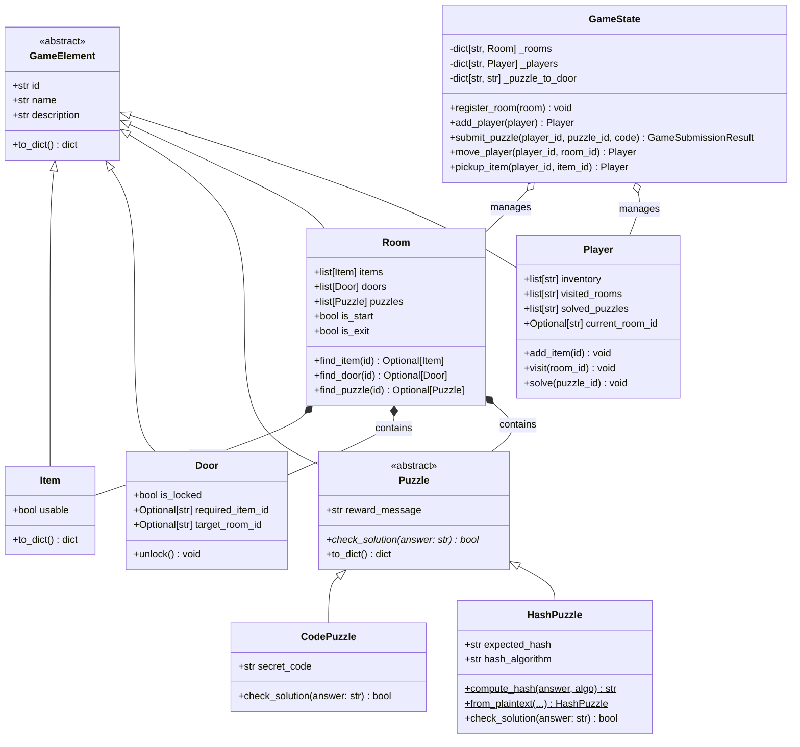

# 🛰️ Operation: Neon Cyberpunk — DigitalEscape Studio

Projet fil rouge : **moteur backend FastAPI** + **frontend React Vite** + **Docker**, pour un jeu d'Escape Game interactif cyberpunk.

> *"Vous infiltrez le mainframe de Neo-Tokyo contrôlé par l'IA Sentinel. Explorez les salles, résolvez les puzzles (codes en clair et hashes SHA-256) et déclenchez l'auto-destruction du système."*

---

## 📁 Structure du projet

```
escape-game/
├── backend/                      # API FastAPI (Python 3.12)
│   ├── app/
│   │   ├── domain/               # 🧩 Classes POO pures (testables sans FastAPI)
│   │   │   ├── game_element.py   #    Classe mère abstraite
│   │   │   ├── item.py           #    Objet interactif
│   │   │   ├── door.py           #    Porte (verrouillée ou non)
│   │   │   ├── puzzle.py         #    Puzzle abstrait + CodePuzzle + HashPuzzle
│   │   │   ├── room.py           #    Salle (composition d'items/doors/puzzles)
│   │   │   ├── player.py         #    Joueur (inventaire + historique)
│   │   │   └── game_state.py     #    État global mutable du jeu
│   │   ├── schemas/              # 📋 Schémas Pydantic (validation HTTP)
│   │   ├── routers/              # 🌐 Endpoints REST
│   │   │   ├── health.py         #    GET /health
│   │   │   ├── players.py        #    CRUD /players (GET/POST/PUT/PATCH/DELETE)
│   │   │   └── player_game.py    #    /rooms, /puzzles/submit, /move, /pickup
│   │   ├── services/
│   │   │   └── game_engine.py    #    Singleton GameState + scénario cyberpunk
│   │   └── main.py               #    Application FastAPI
│   ├── tests/                    # ✅ 26 tests pytest (domaine + API)
│   ├── Dockerfile                # Image Python slim multi-stage
│   ├── requirements.txt
│   └── pytest.ini
│
├── frontend/                     # Interface React (Vite + TypeScript + Tailwind)
│   ├── src/
│   │   ├── api/                  # Client fetch + types TS
│   │   ├── components/           # Header, RoomList, RoomDetail, PuzzleModal...
│   │   ├── styles/globals.css    # Thème cyberpunk (neon, scanlines)
│   │   ├── App.tsx               # Orchestration de l'UI
│   │   └── main.tsx              # Point d'entrée React
│   ├── nginx.conf                # Reverse proxy /api -> backend
│   ├── Dockerfile                # Build Vite -> nginx alpine
│   ├── package.json
│   ├── vite.config.ts            # Proxy dev /api -> http://localhost:8000
│   └── tailwind.config.js
│
└── docker-compose.yml            # Orchestration backend + frontend
```

---

## 🚀 Démarrage rapide

### Option A — Tout en Docker (recommandé)

```bash
docker compose up --build
```

Puis ouvrez :
- **Frontend** : http://localhost:8080
- **API docs (Swagger)** : http://localhost:8000/docs
- **Healthcheck** : http://localhost:8000/health

### Option B — Dev local (backend et frontend séparément)

**Backend** (terminal 1) :
```bash
cd backend
python -m venv .venv
source .venv/bin/activate      # Windows: .venv\Scripts\activate
pip install -r requirements.txt
uvicorn app.main:app --reload --host 0.0.0.0 --port 8000
```

**Frontend** (terminal 2) :
```bash
cd frontend
npm install
npm run dev      # http://localhost:5173 (proxy /api -> backend:8000)
```

### Lancer les tests backend

```bash
cd backend
source .venv/bin/activate
pytest -v
```

---

## 🧩 Diagramme de classes (Mermaid)



---

## 🌐 API REST — Endpoints

| Méthode  | Route                              | Description                                     |
|----------|------------------------------------|-------------------------------------------------|
| `GET`    | `/health`                          | Statut du moteur + métadonnées                  |
| `GET`    | `/rooms`                           | Liste des salles (résumé)                       |
| `GET`    | `/rooms/{room_id}`                 | Détail d'une salle (items, portes, puzzles)     |
| `GET`    | `/players`                         | Liste des joueurs                               |
| `GET`    | `/players/{id}`                    | Détail d'un joueur                              |
| `POST`   | `/players`                         | Créer un joueur                                 |
| `PUT`    | `/players/{id}`                    | Remplacer un joueur                             |
| `PATCH`  | `/players/{id}`                    | Mettre à jour partiellement un joueur           |
| `DELETE` | `/players/{id}`                    | Supprimer un joueur                             |
| `POST`   | `/puzzles/submit`                  | Tenter une solution de puzzle                   |
| `POST`   | `/players/{id}/move/{room_id}`     | Déplacer un joueur                              |
| `POST`   | `/players/{id}/pickup/{item_id}`   | Ramasser un item                                |

> La documentation interactive complète (Swagger UI) est disponible sur `/docs` une fois le backend lancé.

---

## 🔐 Focus sécurité — HashPuzzle

La classe `HashPuzzle` illustre le principe de sécurité **"ne jamais stocker un secret en clair"** :

1. Le code secret n'est **jamais** stocké en clair en mémoire.
2. On stocke uniquement son **empreinte SHA-256** (`expected_hash`).
3. Lors d'une tentative, on calcule le SHA-256 de la réponse et on le compare au hash attendu.
4. La comparaison utilise `hmac.compare_digest` (à temps constant) pour éviter les attaques par **timing side-channel**.
5. La méthode `to_dict()` n'expose **jamais** le hash via l'API (`solution_exposed: false`).

**Exemple** : le mot de passe `neon2099` est stocké sous la forme de son hash SHA-256 :
```
8c4b8e14d3e7e9a1d2f6b5c8d7e2f1a4b3c2d1e0f9a8b7c6d5e4f3a2b1c0d9e8
```
(mais vous ne le verrez jamais dans les réponses de l'API).

---

## ✅ Checklist de validation (TP)

- [x] L'application FastAPI se lance via Uvicorn
- [x] Swagger UI accessible sur `/docs`
- [x] Au moins 2 salles explorables via `GET /rooms/{room_id}` (3 ici)
- [x] `HashPuzzle` vérifie correctement les hashes SHA-256
- [x] Un code vide sur `POST /puzzles/submit` → **422 Unprocessable Entity** (testé)
- [x] Le bon code renvoie `{"success": true, "message": "...Porte déverrouillée !"}`
- [x] Frontend React interactif avec thème cyberpunk
- [x] Conteneurisation Docker (multi-stage builds)
- [x] `docker compose up` lance tout en une commande

---

## 🎮 Scénario — Operation: Neon Cyberpunk

| Salle             | Puzzle associé                | Type       | Solution      |
|-------------------|-------------------------------|------------|---------------|
| `server-room`     | —                             | —          | *(départ)*    |
| `security-hub`    | `puzzle-hub-password`         | Hash SHA-256 | `neon2099`  |
| `mainframe-core`  | `puzzle-final-code`           | Code       | `2000`        |

**Indice in-game** : un post-it dans la salle des serveurs révèle le mot de passe `neon2099`. Le code final (`2000`) est suggéré par l'indice "Année du bug Y2K".

---

## 🛠️ Stack technique

| Couche       | Technologie                                            |
|--------------|--------------------------------------------------------|
| Backend      | Python 3.12 · FastAPI 0.115 · Pydantic 2 · Uvicorn     |
| Frontend     | React 18 · TypeScript 5 · Vite 6 · Tailwind CSS 3      |
| Tests        | pytest 8 · TestClient (httpx)                          |
| Conteneurs   | Docker (multi-stage) · docker-compose                  |
| Serveur web  | nginx alpine (reverse proxy + static hosting)          |

---

## 📜 Licence

Projet pédagogique — DigitalEscape Studio. Utilisation libre à des fins d'apprentissage.
